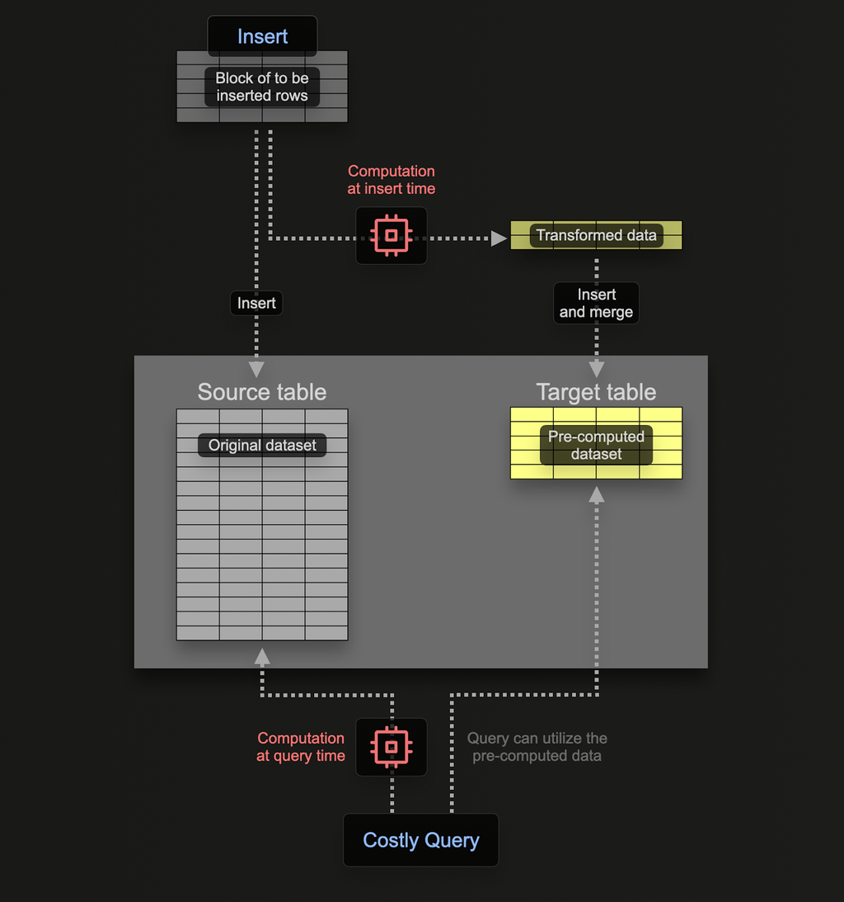
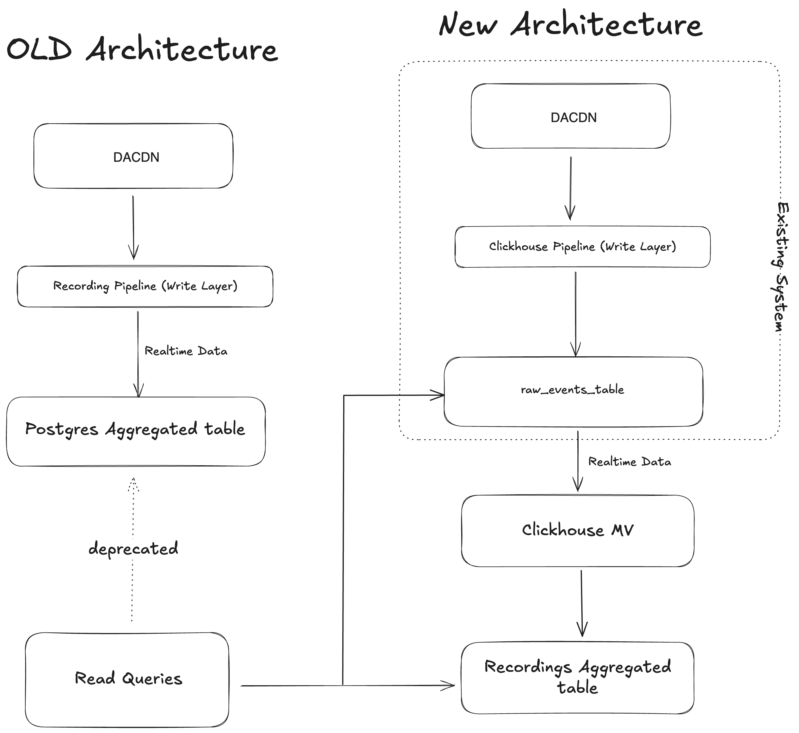
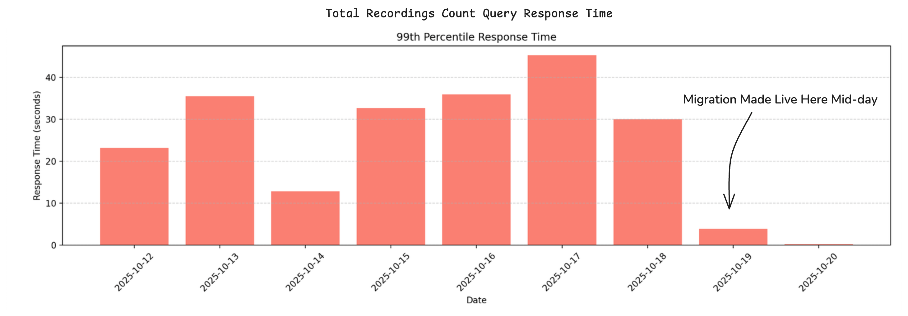

## Overview

In the pursuit of real-time analytics at scale, teams often face a key architectural decision: continue scaling traditional relational databases like PostgreSQL or migrate to analytical columnar databases like ClickHouse.

This post explores a real-world migration from a Postgres-based aggregation pipeline to a ClickHouse architecture leveraging Materialized Views (MVs).

We’ll dive deep into:

- **The motivation behind the migration**
- **How ClickHouse MVs simplify real-time aggregation**
- **Performance and cost outcomes**
- **A detailed comparison between Postgres and ClickHouse**
- **Lessons learned and best practices**

## The Legacy: Postgres Recording Pipeline

### Data Flow

- DACDN ingested real-time event data.
- Data was processed and aggregated through a Recording Pipeline (write layer).
- The processed aggregated events were persisted in a Postgres table.
- Read Queries consumed aggregated results from Postgres.

### Pain Points

Despite Postgres’s robustness and ACID compliance, several scalability issues arose:

- **High operational overhead**: Maintaining both the Recording Pipeline and Postgres at scale required significant infrastructure and engineering investment.
- **Performance bottlenecks**: Query performance degraded as datasets grew, particularly for real-time analytics workloads.
- **Data duplication**: Redundant data persisted across multiple systems for ingestion and query optimization.
- **Limited scalability**: Vertical scaling (more CPU, RAM) reached diminishing returns, while sharding introduced complexity.

## The Modernized Architecture: ClickHouse with Materialized Views

### ClickHouse's Materialized Views Internal Working

<div style="text-align:center; margin: 20px;">
  
</div>

*Image source: [ClickHouse Materialized Views Documentation](https://clickhouse.com/docs/materialized-view/incremental-materialized-view)*

### Our High-Level Architecture

<div style="text-align:center; margin: 20px;">
  
</div>

**New Data Flow**

- DACDN remains the data ingestion entry point.
- Data flows into the ClickHouse Pipeline (write layer).
- Events are written to the base raw events table (`raw_events_table`).
- A Materialized View (MV) performs real-time aggregations into `agg_recordings_table`.
- Read queries now directly query the MV for high-performance reads.

**Benefits**

| **Improvement**        | **Description** |
|------------------------|-----------------|
| **Performance Boost**  | ClickHouse’s columnar engine and compression deliver faster analytical queries. |
| **Simplified Architecture** | Eliminates the Recording Pipeline and Postgres, unifying real-time ingestion and analytics. |
| **Cost Efficiency**    | Reduces infrastructure footprint — fewer moving parts, less operational overhead. |
| **Real-Time Aggregation** | Materialized Views compute aggregates automatically as data arrives. |
| **Scalability**        | ClickHouse efficiently handles billions of events with horizontal scaling and sharding. |
| **Flexibility**        | Compute power is isolated from storage, providing flexibility to scale resources based on needs. |

## Under the Hood: ClickHouse Implementation

### Base Table

Raw events are ingested into `sharded_database.raw_events_table`. This table stores raw events in a highly compressed, columnar format.

### Aggregation Table

The `agg_recordings_table` uses the `AggregatingMergeTree` engine — perfect for pre-aggregated data.

```sql
CREATE TABLE sharded_database.agg_recordings_table
(
    `account_id` UInt32,
    `uuid` String,
    `session_id` DateTime,
    -- additional dimensions/measures
)
ENGINE = AggregatingMergeTree
PARTITION BY toStartOfMonth(session_id)
ORDER BY (account_id, session_id, uuid)
TTL ...
SETTINGS storage_policy = '...';
```

### Materialized View Logic

```sql
CREATE MATERIALIZED VIEW sharded_database.recordings_daily_mv_v1
TO sharded_database.agg_recordings_table
AS SELECT
    account_id,
    uuid,
    coalesce(session_id, toDateTime(0)) AS session_id,
    -- aggregate functions here (e.g., countState(), sumState(), uniqState())
FROM sharded_database.raw_events_table
WHERE /* filtering conditions */;
```

This MV runs continuously — new data triggers aggregation automatically, making the latest analytics instantly queryable.

## Migration Workflow

### Schema Setup

- Create an aggregated (`agg_recordings_table`) table (`raw_events_table` was already present for raw events).
- Deploy Materialized View logic.

### Historical Data Copy

- Migrate historical data from PostgreSQL's aggregated table or ClickHouse's raw events table into ClickHouse's recordings aggregated table.

### Validation

- Compare aggregation outputs between PostgreSQL and ClickHouse to ensure parity.
- Validate query results consumed by read queries.

### Cutover

- Redirect read queries to the ClickHouse MV.
- Deprecate the PostgreSQL pipeline.

### Cleanup

- Decommission the old PostgreSQL infrastructure to save costs.

## Benchmark Insights

While exact metrics vary by dataset, general trends show:

| **Metric**                    | **Postgres**  | **ClickHouse** |
|------------------------------|---------------|----------------|
| Query latency (99th percentile) | 30–50 seconds | 100–300 ms     |
| Storage footprint            | High (row-store) | 75% reduction in storage (columnar) |
| Operational overhead         | High          | Low            |
| Cost efficiency              | Moderate      | Excellent      |

<div style="text-align:center; margin: 20px;">
  
</div>

## PostgreSQL vs ClickHouse: A Deep Dive

| **Aspect**            | **Postgres**               | **ClickHouse**                       |
|-----------------------|----------------------------|--------------------------------------|
| Storage Model         | Row-oriented               | Columnar                             |
| Ideal Workload        | OLTP (transactions)        | OLAP (analytics)                     |
| Indexing              | B-tree, GIN, BRIN          | Sparse indices, partitions           |
| Aggregation Performance | Slower on large datasets | Optimized for massive aggregates     |
| Materialized Views    | Manual refresh required    | Real-time, automatically updated     |
| Schema Flexibility    | High                       | Moderate (needs defined schema)      |
| Joins                 | Strong relational joins    | Limited but improving                |
| Updates/Deletes       | ACID, strong consistency   | Eventual consistency, append-optimized |
| Scalability           | Vertical scaling           | Horizontal (cluster-friendly)        |
| Ecosystem             | Mature, rich tooling       | Rapidly evolving, modern             |

## Lessons Learned

- **Design for immutability**: ClickHouse thrives with append-only workloads.
- **Leverage partitioning**: Time-based partitions (`toStartOfMonth`) optimize queries and TTL-based cleanup.
- **Balance MVs**: Over-aggregating can limit flexibility; under-aggregating can hurt performance.
- **Monitor ingestion lag**: High write rates can cause merge delays.
- **Schema evolution requires care**: Adding new columns or changing types requires explicit handling.

## Why not ClickHouse’s Projections

### Why Materialized Views Are Better Than Projections for This Task

- **Explicit Schema and Separate Storage**: Materialized views store results in their own table with a defined schema, giving more flexibility for complex denormalization. Projections, on the other hand, are tied to the main table and are mostly invisible.
- **Real-Time Updates**: Materialized views automatically update as new data is inserted, making them ideal for continuous, real-time aggregation. Projections focus on optimizing queries over existing data rather than live updates.
- **Complex Transformations and Chaining**: Materialized views can perform multi-step transformations and be chained together, enabling powerful data pipelines. Projections cannot be chained.

## When to Choose ClickHouse

Choose ClickHouse if your workloads are:

- **Analytical and read-heavy**
- **Require sub-second aggregation queries on billions of rows**
- **Can tolerate eventual consistency**
- **Involve streaming or real-time data processing**

Choose PostgreSQL if your workloads are:

- **Transactional or highly relational**
- **Require strong consistency guarantees**
- **Involve frequent row-level updates or joins across normalized data**

## Final Thoughts

The migration from PostgreSQL to ClickHouse marked a significant leap in scalability, performance, and simplicity. By leveraging Materialized Views, the engineering team unlocked near real-time insights, reduced infrastructure complexity, and cut operational costs by 80%.

This evolution reflects a broader industry trend:

> “Move compute closer to the data, automate aggregation, and design for scale from day one.”

As data volumes continue to grow, ClickHouse represents a powerful paradigm for modern analytics engineering — fast, efficient, and purpose-built for the age of streaming data.

## Further Reading

- [ClickHouse Materialized Views Documentation](https://clickhouse.com/docs/materialized-views)
- [ClickHouse AggregatingMergeTree Engine](https://clickhouse.com/docs/engines/table-engines/mergetree-family/aggregatingmergetree)
- [Materialized Views versus Projections](https://clickhouse.com/docs/managing-data/materialized-views-versus-projections)
- [Enhancing ClickHouse Architecture with Distributed Query Engines](https://engineering.wingify.com/posts/enhancing-clickHouse-architecture-with-distributed-query-engines/)
- [DACDN](https://engineering.wingify.com/posts/dynamic-cdn/)


